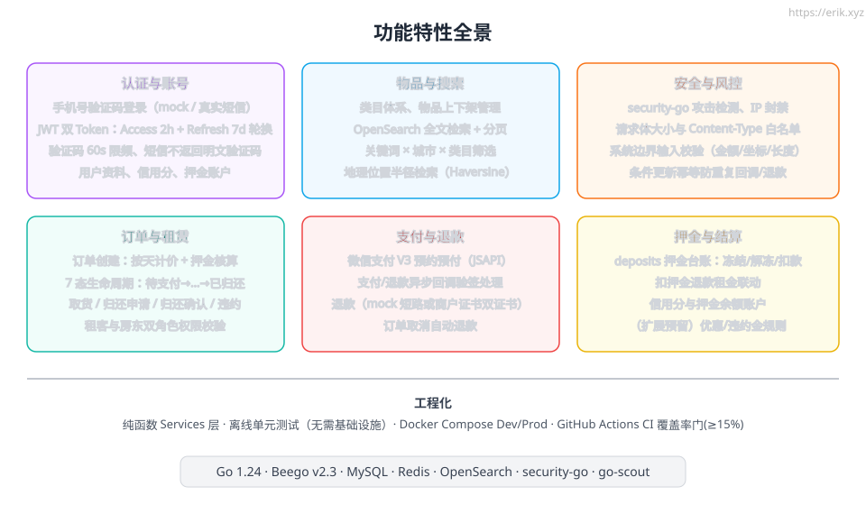
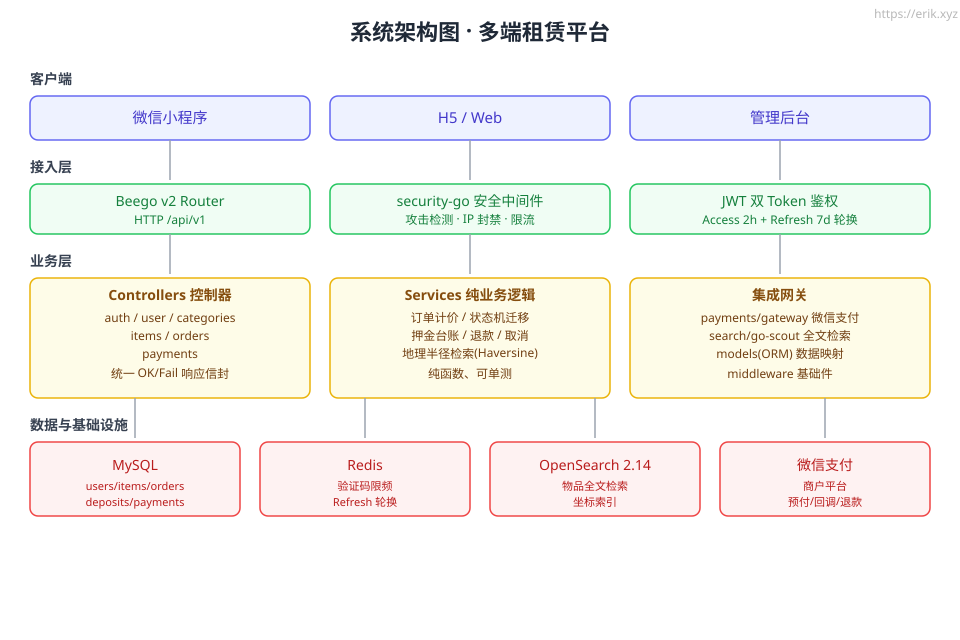
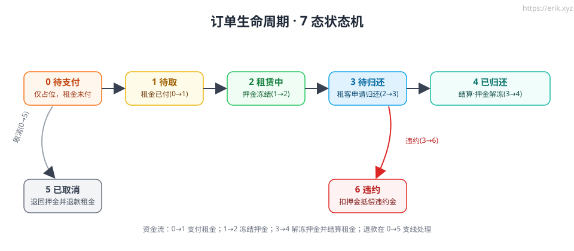
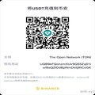

# 多端租赁平台 · item-rental

> 物品租赁**后端服务** — 搜索、下单、支付、押金与违约的完整闭环。


<p align="center">
  
  <br><b>吉祥物 · 租租鼠</b> — 🐹 采用 **Go 官方 Gopher**(CC BY 4.0,Renee French 设计):本项目是 Go 1.24 后端,全球 Go 开发者一眼认出;戴上橙色安全帽 + 胸前 ¥ 徽章 + 怀抱送货箱,把「安全交付、按时归还、押金保障」写进造型。服务启动时控制台也会出现 Gopher(`/static/mascot.svg` 可见)。
</p>

---

## 项目介绍

一个面向 **Flutter 主App / 微信原生小程序**的 P2P 物品租赁平台。房东发布闲置物品,按天计价并收取押金;租客搜索、下单、支付租金、取件使用、按约归还;平台以 7 态订单状态机贯穿租赁全流程,配套押金台账、信用分、站内消息与退款/违约处置。

技术底座:Go 1.24 + Beego v2.3(MVC)+ MySQL + Redis + OpenSearch;**主键 bwmarrin/snowflake**(JSON 字符串输出,JS 安全);phone 哈希 + 实名加密存储(ITEM_RENTAL_PII_KEY);微信支付网关抽象(默认 mock 预支付/验签回调/退款,商户凭据就绪即可切真);security-go 攻击检测 + IP 封禁(文件持久化)。双端前端:`apps/flutter`(13 页)与 `apps/wxapp`(13 页 ×4 件套,微信原生)。

## 功能特性

<p align="center"></p>

- **认证与账号**:手机号验证码登录(mock/真实短信)、JWT 双 Token(Access 2h + Refresh 7d **多端并存、单端登出**轮换)、验证码 60s 限频、用户资料/信用分/押金账户/实名(加密存储)。
- **物品与发布**:类目体系、上下架、**多图上传**(POST /items/upload,≤9×4MB)、详情 owner 公开信息富化(昵称/头像/信用分)。
- **搜索**:OpenSearch 全文检索、关键词×城市×类目筛选、**精确地理位置距离检索**(geo_point + WhereGeoDistance;无 OS 时 Haversine 兜底)。
- **订单与租赁**:按天计价 + 押金核算、7 态生命周期、取货/归还申请/归还确认/违约、**信用分履约联动**(归还 +5/违约 -30/已付取消 -10,credit_events 流水)、**站内消息**(支付/退款/归还/违约/取消事件)。
- **支付与退款**:微信支付网关抽象(mock 预付/回调验签/退款;真商户就绪即切)、订单取消自动退款、**退款状态守卫**(仅待取可退,租赁中 409)。
- **押金与结算**:deposits 台账(冻结/解冻/扣款)、违约扣押金入物主账、`o.Raw` 精确落库(阶段E 修复)。
- **安全与隐私**:security-go 攻击检测 + **IP 封禁文件持久化**、统一边界校验、**主键 snowflake 字符串契约**(JS 安全)、phone sha256 + real_name AES-GCM(密钥 fail-fast)。

## 技术架构

<p align="center"></p>

| 层 | 组件 |
| --- | --- |
| 客户端 | Flutter 主App(移动/Web)· 微信原生小程序(13 页 ×4 件套) |
| 接入层 | Beego Router(方法感知鉴权) · security-go · JWT 双 Token |
| 业务层 | Controllers(统一信封) · Services(纯业务逻辑) · 集成网关(payments/search/models/middleware) |
| 数据与基础设施 | MySQL · Redis · OpenSearch 2.14 · 微信支付商户平台 |

## 订单生命周期

<p align="center"></p>

| 状态 | 含义 | 主要动作 |
| --- | --- | --- |
| 0 待支付 | 仅占位,租金未付 | — |
| 1 待取 | 租金已付 | 0→1 支付回调 |
| 2 租赁中 | 押金冻结 | 1→2 取货 |
| 3 待归还 | 租客申请归还 | 2→3 归还申请 |
| 4 已归还 | 结算,押金解冻 | 3→4 归还确认 |
| 5 已取消 | 退回押金并退款租金 | 0→5 取消(退款) |
| 6 违约 | 扣押金抵偿违约金 | 3→6 违约 |

资金流:0→1 支付租金;1→2 冻结押金;3→4 解冻押金并结算;退款在 0→5 支线处理。

## 项目结构

```
item-rental/
├── server/                  # Go 后端(Beego v2)
│   ├── main.go              # 入口(启动迁移 + 索引重建)
│   ├── conf/app.conf        # 配置(环境变量覆盖见 config-runbook)
│   ├── routers/router.go    # 路由与方法感知鉴权
│   ├── controllers/         # 控制器(统一 OK/Fail 信封)
│   ├── services/            # 纯业务逻辑(单据/计价/状态机,可单测)
│   ├── models/              # ORM 模型 users/items/orders/deposits/payments/messages/credit_events(snowflake 主键)
│   ├── payments/            # 支付网关抽象(预付/回调验签/退款,mock 默认)
│   ├── search/              # go-scout 检索(索引/geo mapping/半径)
│   ├── middleware/          # JWT 双 Token、security-go(IP 封禁文件持久化)
│   ├── services/            # 纯业务 + snowid/信用分/pii 等
│   ├── static/              # 静态资源(吉祥物 mascot.svg, GET /static/mascot.svg;uploads/ 上传目录)
│   └── *_test.go            # 离线单测,免基建
├── apps/flutter             # Flutter 主App(13 页)
├── apps/wxapp               # 微信原生小程序(13 页 ×4 件套)
├── deploy/                  # Docker Compose(dev/prod)、Schema、镜像
├── docs/                    # 架构/功能/生命周期 SVG、支付码、配置与规划文档
├── scripts/                 # push-release.sh(增量 tag + Release)、e2e-smoke.sh(E2E 冒烟真源)
└── .github/workflows/       # ci.yml(lint/test/flutter-gate)、nightly.yml(每日 E2E,mysql service)
```

## 使用说明

### 环境要求

- Go 1.24+;Docker + Docker Compose(mysql:8、redis:7、opensearch:2.14)
- 微信支付商户密钥(M3 证书;mock 模式不需要)

### 本地开发

```bash
# 1. 起基础设施(dev compose;若宿主机 3306 被占,设 MYSQL_HOST_PORT=3307)
docker compose -f deploy/docker-compose.yml up -d

# 2. 起服务(dev 自动建表 + 启动重建索引;OpenSearch 不可用也不崩)
#    必设 env:JWT 密钥 + PII 密钥(缺失 fail-fast panic);mock 支付/验证码可带 WECHAT_MOCK=1
cd server && ITEM_RENTAL_JWT_SECRET=<强随机串> ITEM_RENTAL_PII_KEY=<64hex> WECHAT_MOCK=1 go run .
```

冒烟验证(短信为 mock,验证码 `123456`):

```bash
# 登录得 token
curl -s -X POST http://127.0.0.1:8080/api/v1/auth/sms -H 'Content-Type: application/json' \
  -d '{"phone":"13800138000"}'
curl -s -X POST http://127.0.0.1:8080/api/v1/auth/login -H 'Content-Type: application/json' \
  -d '{"phone":"13800138000","code":"123456"}'
# 发布物品(JWT)
curl -s -X POST http://127.0.0.1:8080/api/v1/items -H "Authorization: Bearer $TOKEN" \
  -H 'Content-Type: application/json' \
  -d '{"title":"单反相机","category_id":1,"daily_price":30,"deposit":200,"stock":1}'
# 公开读详情(无需 token)
curl -s http://127.0.0.1:8080/api/v1/items/1
```

### 测试与构建

```bash
cd server && go build ./... && go vet ./... && go test ./... -count=1   # 离线全绿
```

### 生产部署

```bash
docker compose -f deploy/docker-compose.prod.yml up -d   # 端口覆盖 3307/16379/9200
BEEGO_RUNMODE=prod ./server                 # 或容器内运行
```

> 必设密钥/env(缺失即 fail-fast):`ITEM_RENTAL_JWT_SECRET`、`ITEM_RENTAL_PII_KEY`、`WECHAT_MOCK=0` + 商户配置、`SCOUT_DRIVER=opensearch` + `OPENSEARCH_*`、`ITEM_RENTAL_TRUSTED_PROXY`(反代后)——完整键表与启动前必检见 [docs/config-runbook.md](docs/config-runbook.md);上线前置 gate 清单见 [docs/task.md §11](docs/task.md)。
> 端口占用与 OpenSearch 安全配置等坑位详见 [docs/design.md](docs/design.md) 排查要点。

### 推送与版本发布(推送规则)

```bash
./scripts/push-release.sh            # 推送分支 → 读最新 tag → 增量 patch 版 tag + GitHub Release
./scripts/push-release.sh --minor    # 或 --major / --version v2.0.0
```

规则:读取仓库最高 `v*` tag(无则从 `v0.0.0` 起步)→ 推送当前分支代码 → 增量 bump 版本 → 打注解 tag 并推送 → `gh release create --generate-notes`(自动收录自上一 tag 以来的提交)。需 git 干净工作区,已存在的版本拒绝重复。

## API 概览

`Base URL: /api/v1`;除标注「公开」外均需 `Authorization: Bearer <AccessToken>`。

### 认证 / 用户

| 方法 | 路径 | 鉴权 | 说明 |
| --- | --- | --- | --- |
| POST | /auth/sms | 公开 | 发送验证码(60s 限频) |
| POST | /auth/login | 公开 | 验证码登录(自动注册) |
| POST | /auth/refresh | 公开 | 双 Token 轮换 |
| GET / PUT | /user/profile | JWT | 查看 / 更新资料 |

### 类目 / 物品

| 方法 | 路径 | 鉴权 | 说明 |
| --- | --- | --- | --- |
| GET | /categories | 公开 | 类目列表 |
| GET | /items | 公开 | 物品分页列表(city/category) |
| GET | /items/search | 公开 | 关键词搜索 + 半径检索 |
| GET | /items/:id | 公开 | 物品详情 |
| POST | /items | JWT | 发布物品 |
| PUT | /items/:id | JWT(owner) | 修改物品 |
| POST | /items/:id/offshelf | JWT(owner) | 下架(同步删索引) |

### 订单(全部 JWT)

| 方法 | 路径 | 说明 |
| --- | --- | --- |
| POST | /orders | 创建订单(status=0) |
| GET | /orders | 我的订单 |
| GET | /orders/:id | 订单详情(renter/owner) |
| POST | /orders/:id/pickup | 取货(1→2,冻结押金) |
| POST | /orders/:id/return_request | 申请归还(2→3) |
| POST | /orders/:id/return_confirm | 确认归还(3→4,解冻结算) |
| POST | /orders/:id/breach | 违约(3→6,扣押金) |
| POST | /orders/:id/cancel | 取消(0→5,退款) |

### 支付

| 方法 | 路径 | 鉴权 | 说明 |
| --- | --- | --- | --- |
| POST | /pay/unifiedorder | JWT | 微信预付(JSAPI) |
| POST | /pay/refund | JWT(owner/renter) | 退款 |
| POST | /pay/notify | 回调验签 | 支付/退款结果回调 |

## 相关文档

- [docs/plan.md](docs/plan.md) — 项目规划与路线图
- [docs/task.md](docs/task.md) — 任务清单与状态
- [docs/design.md](docs/design.md) — 设计决策与排查要点
- [docs/api.md](docs/api.md) — API 接口文档(接口/请求/响应/错误码)
- [docs/config-runbook.md](docs/config-runbook.md) — 配置键与部署手册
- [docs/frontend-plan.md](docs/frontend-plan.md) — 前端页面规划(仅规划)

## 支持与打赏

项目由个人维护。如果它对你有帮助,欢迎支持 — 你的每一份心意都是持续维护的动力。💛

| 打赏方式 | 二维码 |
| --- | --- |
| 微信赞赏码 |  |
| 支付宝收款码 |  |

> 左侧为**微信赞赏码**,右侧为**支付宝收款码**,分别对应微信与支付宝应用内扫码。

也支持虚拟币打赏(下方二维码与收款地址一一对应):

| # | 网络 | 收款地址 |
| --- | --- | --- |
| 1 | BNB Smart Chain (BEP20) |  `0x355d429f97511897ccb4e271ec888205f9ab6629` |
| 2 | Tron (TRC20) |  `TEdDHWLajt1XvqtPDWmQctdrJaC3pzZZzz` |
| 3 | Ethereum (ERC20) |  `0x355d429f97511897ccb4e271ec888205f9ab6629` |
| 4 | Aptos |  `0x836e3780edfc3f7b2372b39e2a1a3a5d7adfaccd96c726f21cfde1b50dd68030` |
| 5 | Plasma |  `0x355d429f97511897ccb4e271ec888205f9ab6629` |
| 6 | Polygon POS |  `0x355d429f97511897ccb4e271ec888205f9ab6629` |
| 7 | Solana |  `2hfhboHdmdrYsY25XfQSsEWxq5ip4EQsR7f4AzSRMUyr` |
| 8 | The Open Network (TON) |  `UQB9kFQohzmXUir9QSSZq01iwl9aQZIDdBpNmDklljRtCoGK` |
| 9 | Arbitrum One |  `0x355d429f97511897ccb4e271ec888205f9ab6629` |
| 10 | AVAX C-Chain |  `0x355d429f97511897ccb4e271ec888205f9ab6629` |

## License

[MIT](./LICENSE) © 2026 erik.xyz

---

*Generated with https://erik.xyz*